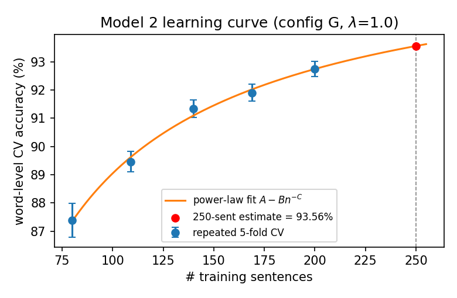

# HW1 — MEMM POS Tagging — Report

**Name:** ____________   **ID:** 000000000

> Final-PDF formatting: one A4 page, Arial 10, 1.15 spacing, 2.54 cm margins, single column,
> figure centred with caption below. This .md is the content draft, not the submitted file.

## Overview

I train a trigram MEMM by L2-regularized maximum likelihood (L-BFGS). The provided code applied
a **single global count threshold** to every feature; with the strict parameter caps (Model 1
≤10,000, Model 2 ≤500) this is too blunt — it discards rare-but-informative features while keeping
many redundant ones. I replaced it with **per-family thresholds**: the threshold is a dict
`{feature_family: min_count}` (default 1), so each family is pruned independently and the budget is
steered to the families that actually help. Each model is then just a choice of per-family
thresholds, which I selected by search (Model 1 on `test1`, Model 2 by cross-validation).

## Feature families and their method

Every feature is a binary indicator `(family, key)`; `iter_features` defines them once so training
and inference agree. Beyond the provided `f100` (word+tag) I implemented:

- **Lexical / morphological:** `f101` suffix and `f102` prefix of length 1–4 (+tag) — capture
  morphology and fire on unseen words; `f100` exact word+tag.
- **Tag context (vocabulary-free, generalize perfectly):** `f103` tag trigram, `f104` tag bigram,
  `f105` tag unigram.
- **Word context:** `f106` previous-word, `f107` next-word (+tag).
- **Required capital/number + orthography (tag-keyed, cheap):** `f_cap` (has uppercase),
  `f_num` (has digit), `f_is_number` (whole-word number incl. floats), `f_all_upper` (acronyms),
  `f_first_upper` (mid-sentence capital → proper noun), `f_hyphen` (internal hyphen).
- **Word shape:** `f_shape`, `f_prev_shape`, `f_next_shape` — collapse a word to a pattern
  (`Apple`→`Xx`, `3.14`→`d.d`) so the tagger generalizes from orthography, even around OOV
  neighbours.
- **Back-off:** `f_lower` — the lower-cased word+tag, so `"The"` shares evidence with `"the"`.

**Model 1** (config L, λ=0.3): keeps all families; `f_lower` at its sweet spot (3,003 feat) is the
decisive lever → 9,814 params. **Model 2** (config G, λ=1.0): 250 OOV-heavy biomedical sentences,
so I drop the sparse word-context families and spend the 500 budget on suffixes (`f101`, ~half),
tag context, shape and a thin back-off → 491 params.

## Training

`main.py --model_number N` builds the features for that model's tuned config and fits the weights
with L-BFGS using the provided objective/gradient (linear term − log-normalizer − ½λ‖w‖²). The
objective is convex, so the optimum is unique and training is reproducible regardless of
initialization. Weights are pickled to `trained_models/weights_N.pkl` (I strip the training-only
statistics/matrices first, keeping the file <1 MB).

## Inference

`memm_viterbi` runs trigram Viterbi in log-space over `(prev_tag, cur_tag)` states with a beam
(top-50 states/position) for speed. For each word the candidate tags are restricted by an OOV
back-off chain — tags seen with the exact word, else its shape, else its longest suffix, else all
tags — which both accelerates decoding and yields sensible guesses for unseen words.

## Test and evaluation

Model 1 is evaluated on the held-out `test1.wtag`: **95.93 %** word accuracy. Model 2 has no test
set, so I use **repeated 5-fold cross-validation** (5 seeds × 5 folds): **92.7 % ± 0.24 (95 % CI)**.
Since folds train on only ~200 of 250 sentences, I fit a power-law learning curve (Fig. 1) and
extrapolate to the full model (**93.6 %**). The competition file is not harder than CV — its OOV
rate (21.0 %) matches the CV held-out rate (20.8 %) — so I **predict ≈ 93 % on `comp2.words`**.

*Figure 1. Model 2 (config G) repeated-5-fold CV accuracy vs. training-set size, with a power-law
fit; the submitted model trains on all 250 sentences (red, ≈ 93.6 %).*

## Competition

`generate_comp_tagged.py` loads the saved weights and tags `comp1.words` / `comp2.words` into
`comp_m1_<id>.wtag` / `comp_m2_<id>.wtag` (`word_TAG`, original sentence order). Because training is
deterministic, these files reproduce exactly from the submitted models.
